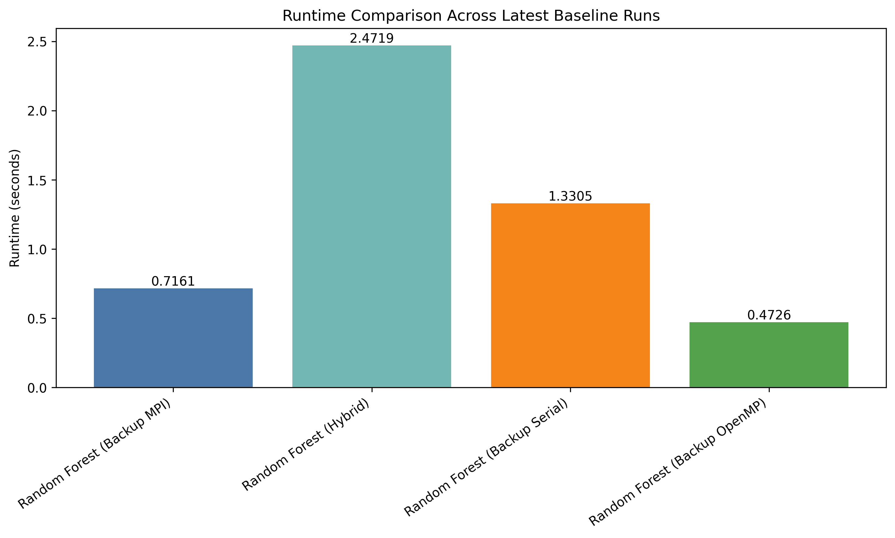
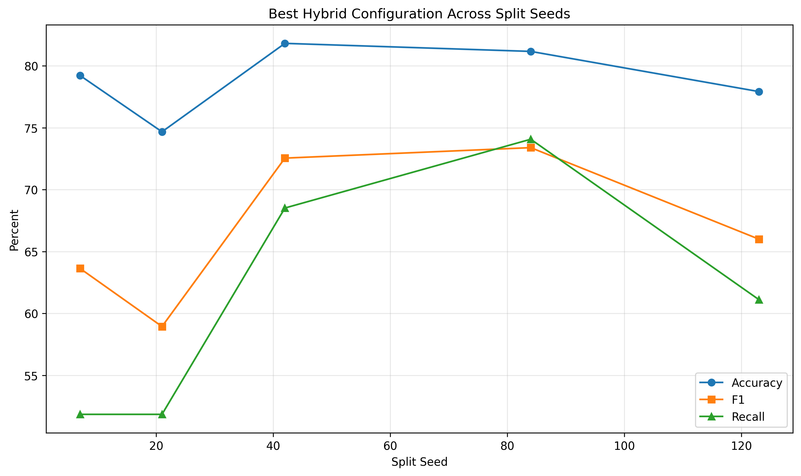

# MPI + OpenMP Parallel Random Forest

A hybrid Random Forest implementation using MPI (Message Passing Interface) for distributed computing and OpenMP for shared-memory parallelism. The project now uses a held-out validation workflow, stratified splitting, train-only preprocessing, and per-run artifact export so results are reproducible and easier to compare.

## Features

- **Hybrid Parallelization**: Combines MPI for distributed tree training across ranks with OpenMP for shared-memory parallelism inside each rank
- **Validation-Aware Workflow**: Uses stratified train/validation splitting instead of evaluating on the full training dataset
- **Optimized Training**: Uses histogram-based split finding and binned data representation for fast tree building
- **Experiment Tracking**: Saves timestamped `metrics.json` files for every run under `Results/runs/`
- **Comparison Tooling**: Includes seed sweeps, summary generation, visualization scripts, and backup baseline comparisons

## Project Structure

```text
.
├── src/
│   ├── main.cpp                     # Hybrid RF main program (MPI + OpenMP)
│   ├── mpi_forest.cpp               # MPI Random Forest implementation
│   ├── forest.cpp                   # Random Forest implementation
│   ├── tree_builder.cpp             # Decision tree builder
│   ├── histogram.cpp                # Histogram-based split finding
│   ├── bins.cpp                     # Data binning functions
│   ├── backup_rf_serial_compare.cpp # Backup serial RF under current validation protocol
│   ├── backup_rf_openmp_compare.cpp # Backup OpenMP RF under current validation protocol
│   └── backup_rf_mpi_compare.cpp    # Backup MPI RF under current validation protocol
├── include/
│   ├── mpi_forest.h                 # MPI Forest header
│   ├── forest.h                     # Random Forest header
│   ├── tree_builder.h               # Tree builder header
│   ├── histogram.h                  # Histogram header
│   ├── bins.h                       # Binning header
│   └── backup_compare_utils.h       # Shared validation / metrics helpers for backup baselines
├── Results/
│   ├── runs/                        # Per-run metrics artifacts
│   ├── summaries/                   # Aggregated summary JSON / CSV outputs
│   ├── plots/                       # Generated plot outputs
│   ├── summarize_runs.py            # Multi-run summary script
│   ├── compare_models.py            # Plotting script for run artifacts
│   └── compare_backup_baselines.py  # Compact comparison of latest backup vs hybrid runs
├── Makefile                         # Build and experiment targets
├── diabetes.csv                     # Dataset file
└── README.md                        # This file
```

## Requirements

- **MPI**: OpenMPI or MPICH
- **OpenMP**: OpenMP library (`libomp`)
- **C++ Compiler**: C++17 compatible (`clang++` or `g++`)
- **Operating System**: macOS, Linux, or Unix-like system

### Installation (macOS)

```bash
# Install MPI
brew install open-mpi

# Install OpenMP
brew install libomp
```

### Installation (Linux)

```bash
# Ubuntu/Debian
sudo apt-get install libopenmpi-dev openmpi-bin libomp-dev

# CentOS/RHEL
sudo yum install openmpi-devel libomp-devel
```

## Quick Start

From the project root, the normal user flow is:

```bash
make clean
make all
make run
```

That sequence:

- removes previously built executables
- rebuilds the default hybrid MPI + OpenMP executable `mpi_forest`
- runs the default MPI launch path, which is `make run -> make run-mpi`

By default, `make run` uses `2` MPI ranks. To change that:

```bash
make NP=4 run
```

## Make Targets

### Main Build and Run Targets

```bash
make clean        # remove built executables
make all          # build the default hybrid executable: ./mpi_forest
make run          # run the default target (same as: make run-mpi)
make run-mpi      # mpirun -np $(NP) ./mpi_forest
make run-hybrid   # mpirun -np $(NP) ./hybrid_rf
```

### Additional Build Targets

```bash
make mpi_forest
make hybrid_rf
make backup_rf_serial_compare
make backup_rf_openmp_compare
make backup_rf_mpi_compare
```

### Backup / Comparison Targets

```bash
make run-backup-serial
make run-backup-openmp
make run-backup-mpi
make compare-backup-baselines
```

### Experiment / Results Targets

```bash
make sweep-seeds
make summarize-runs
make visualize
```

## Common Make Usage

### Default Run

```bash
make clean
make all
make run
```

### Run with More MPI Ranks

```bash
make NP=4 run
```

### Run Tuned Hyperparameters

```bash
make NP=2 RUN_ARGS="--trees 300 --max-depth 12 --min-samples-split 10" sweep-seeds
```

### Run a Single Manual MPI Command

If you want to bypass `make run` and launch directly:

```bash
mpirun -np 2 ./mpi_forest
```

Example with custom hyperparameters:

```bash
mpirun -np 2 ./mpi_forest --trees 300 --max-depth 12 --min-samples-split 10
```

Example with a different split seed:

```bash
mpirun -np 2 ./mpi_forest --split-seed 84 --trees 300 --max-depth 12 --min-samples-split 10
```

## Make Variables

The `Makefile` currently exposes these user-facing variables:

- `NP`: number of MPI ranks used by `run-mpi`, `run-hybrid`, `run-backup-mpi`, and `sweep-seeds` (default: `2`)
- `SEEDS`: split seeds used by `make sweep-seeds` (default: `7 21 42 84 123`)
- `RUN_ARGS`: extra command-line flags appended during `make sweep-seeds`

Examples:

```bash
make NP=4 run
make SEEDS="42 84" sweep-seeds
make NP=2 RUN_ARGS="--train-fraction 0.8 --trees 300 --max-depth 12 --min-samples-split 10" sweep-seeds
```

## Backup Baseline Commands

Run the repaired backup serial RF under the current validation protocol:

```bash
make run-backup-serial
```

Run the repaired backup OpenMP RF with 4 threads:

```bash
make run-backup-openmp
```

Run the repaired backup MPI RF with 2 ranks by default:

```bash
make run-backup-mpi
```

Run the latest backup-vs-hybrid baseline comparison:

```bash
make compare-backup-baselines
```

## Experiment Configuration

The hybrid executable supports:

- `--train-fraction FLOAT`
- `--split-seed INT`
- `--trees INT`
- `--max-depth INT`
- `--min-samples-split INT`
- `--max-features INT`

Example:

```bash
mpirun -np 2 ./mpi_forest \
  --train-fraction 0.8 \
  --split-seed 42 \
  --trees 300 \
  --max-depth 12 \
  --min-samples-split 10
```

Current strong candidate configuration:

- **Train Fraction**: `0.8`
- **Split Seed**: `42`
- **Number of Trees**: `300`
- **Max Depth**: `12`
- **Min Samples Split**: `10`
- **Max Features**: `sqrt(num_features)` which resolves to `2` for this dataset

## Performance

### Important Note

Older versions of this project reported `99%+` metrics because they trained and evaluated on the same dataset. The current workflow reports held-out validation metrics instead.

### Current Hybrid Baseline

For:

- `2 MPI ranks`
- `train_fraction=0.8`
- `split_seed=42`
- `trees=100`
- `max_depth=10`
- `min_samples_split=2`

Observed held-out validation metrics were approximately:

- **Accuracy**: `81.17%`
- **Precision**: `75.51%`
- **Recall**: `68.52%`
- **F1 Score**: `71.84%`

For the stronger tuned configuration:

- `trees=300`
- `max_depth=12`
- `min_samples_split=10`
- auto `max_features=2`

Multi-seed averages across seeds `7 21 42 84 123` were approximately:

- **Mean Accuracy**: `78.96%`
- **Mean F1 Score**: `66.91%`

### Example Output

```text
============================================================
Hybrid MPI + OpenMP Random Forest
============================================================
Loaded dataset: 768 samples, 8 features
Experiment config: train_fraction=0.8, split_seed=42, trees=300, max_depth=12, min_samples_split=10, max_features=-1
Train/validation split: 614 train, 154 validation
Stratified class counts: train_pos=214/614, val_pos=54/154
Applied median imputation for zero-invalid columns: 1->117, 2->72, 3->29, 4->126, 5->32.4

===== FULL MODEL METRICS =====
Accuracy:    81.8182%
Precision:   77.0833%
Recall:      68.5185%
Overhead:    18.1818%
F1 Score:    72.549%
================================
```

## Results

The project uses the [`Results/`](Results/) directory for experiment review:

- [`Results/runs/`](Results/runs/) stores the curated comparison artifacts
- [`Results/summaries/summary_20260501_200243.csv`](Results/summaries/summary_20260501_200243.csv) stores the compact summary
- [`Results/summaries/summary_20260501_200243.json`](Results/summaries/summary_20260501_200243.json) stores the same summary in JSON form
- [`Results/plots/`](Results/plots/) stores the exported comparison plots
- [`Results/random_forest_results.ipynb`](Results/random_forest_results.ipynb) provides the notebook-based results review

The notebook focuses on two views:

1. **Latest baseline comparison**  
   Serial vs OpenMP vs MPI vs Hybrid

2. **Best current Hybrid configuration**  
   The tuned `~80% accuracy` family across split seeds `7`, `21`, `42`, `84`, `123`

### Example Graphs

#### Baseline Runtime Comparison

[Open plot](Results/plots/baseline_runtime.png)



#### Best Hybrid Across Split Seeds

[Open plot](Results/plots/best_hybrid_seeds.png)



## How It Works

1. **Data Loading**: Rank 0 loads `diabetes.csv` and broadcasts it to all ranks
2. **Validation Split**: All ranks construct the same stratified train/validation split
3. **Train-Only Preprocessing**: Invalid zero values are imputed from training medians only, then train-derived scaling/binning is applied
4. **Tree Distribution**: Trees are split across MPI ranks
5. **Parallel Training**: Each rank trains its local trees, using OpenMP inside the rank
6. **Vote Aggregation**: Tree votes are summed across ranks using `MPI_Allreduce`
7. **Artifact Export**: Metrics are written to a timestamped run directory for later comparison

## Architecture

- **MPI Layer**: Handles distributed computing across multiple processes
- **OpenMP Layer**: Parallelizes local work inside each MPI rank
- **Histogram-based Splits**: Fast split finding using binned data representation
- **Bootstrap Sampling**: Each tree uses a random bootstrap sample of the training data
- **Train-Only Preprocessing**: Prevents leakage from validation into training

## Dataset

The code uses the `diabetes.csv` dataset with:

- **Samples**: `768`
- **Features**: `8`
- **Classes**: `2` (`0 = No Diabetes`, `1 = Diabetes`)

The current preprocessing also treats zero as invalid for:

- `Glucose`
- `BloodPressure`
- `SkinThickness`
- `Insulin`
- `BMI`

These are imputed using training-only medians before scaling / binning.

## Troubleshooting

### Build Issues

If you encounter OpenMP errors on macOS:

```bash
# Check OpenMP library location
find /opt/homebrew -name "libomp*" 2>/dev/null
```

If your system uses different OpenMP paths, update [Makefile](/Users/benstahatch/Documents/Hybrid-Revision/csci4330-fall2025-group/Makefile:1) accordingly.

### Runtime Issues

If MPI fails to run:

```bash
which mpirun
mpirun --version
```

MPI launchers may need local socket access even on one machine because they start multiple processes and set up communication channels between ranks.

### Plotting Issues

If `make visualize` fails:

```bash
python3 -c "import matplotlib, numpy"
```

Then install missing packages if needed:

```bash
pip3 install matplotlib numpy
```
